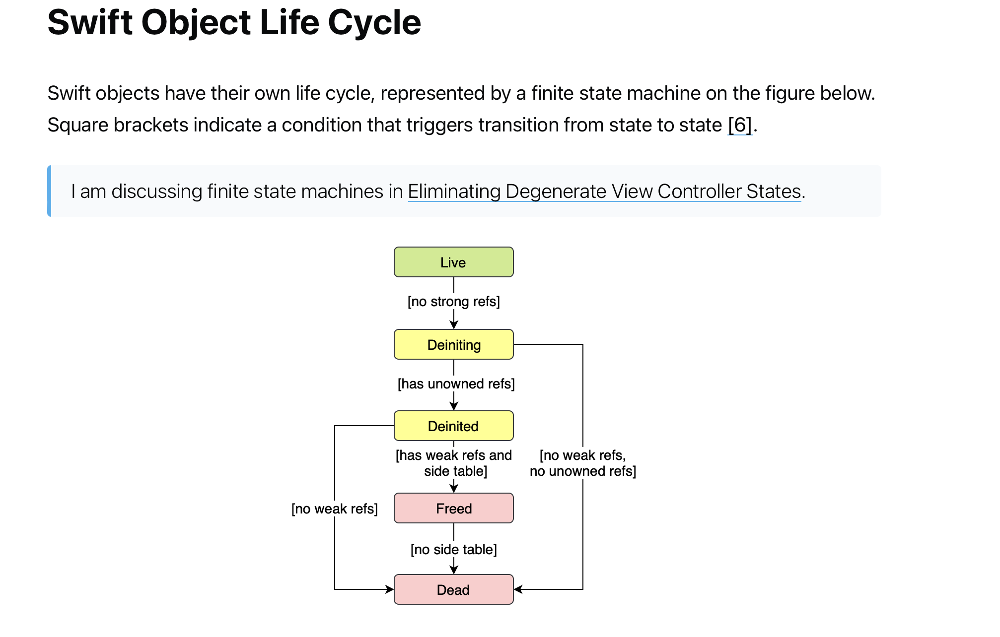

# Method Dispatch
- 🟧 [Method dispatch in Swift](https://trinhngocthuyen.com/posts/tech/method-dispatch-in-swift/)
- 🟧 [Диспетчеризация методов в Swift](https://habr.com/ru/articles/714830/)
- 🟧 [Method Dispatch](https://habr.com/ru/articles/673400/)
- 🟧 [Диспетчеризация в Swift: погружение в теорию и практику](https://habr.com/ru/companies/simbirsoft/articles/673636/)

Управление памятью в Swift
- 🟩 
- 🟧 [Управление памятью в Swift](https://habr.com/ru/articles/592385/)
- 🟧 [Эппловая дока по памяти и ARC](https://developer.apple.com/library/archive/documentation/Cocoa/Conceptual/MemoryMgmt/Articles/MemoryMgmt.html#//apple_ref/doc/uid/10000011i)
- 🟧 [Advanced iOS Memory Management with Swift: ARC, Strong, Weak and Unowned Explained](https://www.vadimbulavin.com/swift-memory-management-arc-strong-weak-and-unowned/)
- 🟧 [Stack vs Heap Memory Allocation](https://net-informations.com/faq/net/stack-heap.htm)
- 🟧 [Swift: ARC и управление памятью](https://habr.com/ru/articles/451130/)
- 🟧 [Память в Swift от 0 до 1](https://habr.com/ru/companies/hh/articles/546856/)

# 
